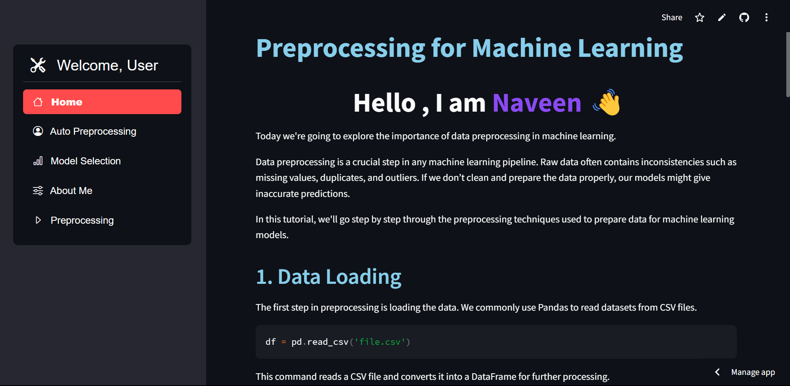
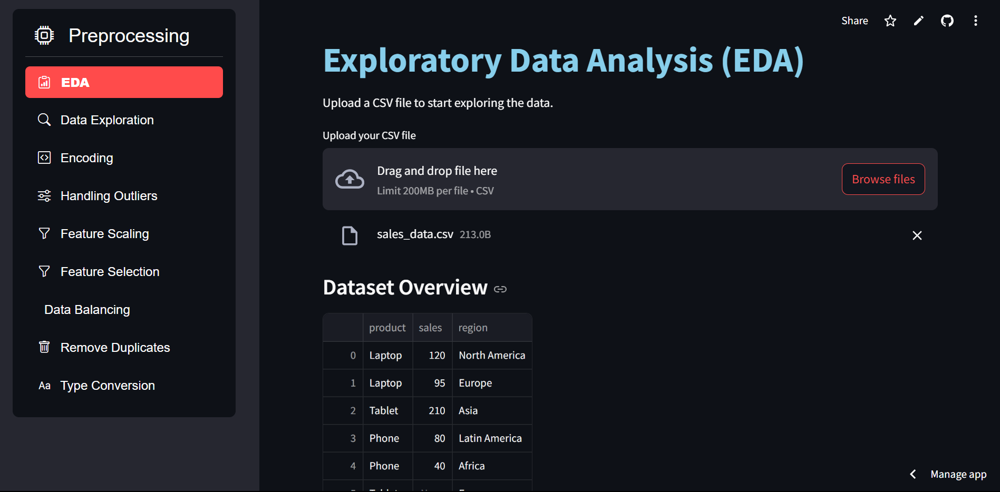

# Data Processing Tool - Streamlit App

Welcome to the **Data Processing Tool**! This Streamlit-based app is designed for efficient data preprocessing and exploration. Whether you're preparing data for machine learning models or performing exploratory data analysis, this tool provides all the necessary functionalities in one place.

## 🚀 Features

### 📌 Main Pages:
- **Home**: Overview and introduction to the tool.
- **Auto Preprocessing**: Automatically preprocess CSV data for common data issues.
- **Model Selection**: Helps you choose the right model based on your dataset and task.
- **About Me**: This provides a snapshot of who I am!.

### 🛠 Preprocessing Pages:
- **EDA (Exploratory Data Analysis)**: Visualize and understand your dataset with plots and summaries.
- **Data Exploration**: Uncover patterns and insights in your dataset.
- **Encoding**: Apply encoding techniques like one-hot encoding and label encoding.
- **Handling Outliers**: Detect and manage outliers effectively.
- **Feature Scaling**: Normalize or standardize features.
- **Feature Selection**: Choose the most important features for your model.
- **Data Balancing**: Handle class imbalances in your dataset.
- **Remove Duplicates**: Detect and remove duplicate entries.
- **Type Conversion**: Convert data types for proper analysis.

## 📥 Installation

To get started with this app, ensure you have Python and Streamlit installed:

1. Install Python from [python.org](https://www.python.org/).
2. Install Streamlit by running:
   ```bash
   pip install streamlit
   ```
3. Install the required dependencies:
   ```bash
   pip install -r requirements.txt
   ```

## ▶️ How to Run the App

1. Clone this repository:
   ```bash
   git clone https://github.com/naveencreation/ML-Preprocessing-Tool.git
   ```
2. Navigate to the project folder:
   ```bash
   cd data-processing-tool
   ```
3. Run the Streamlit app:
   ```bash
   streamlit run app.py
   ```
4. The app will open in your browser for easy data exploration and preprocessing!

## 🌐 Live Demo
Check out the deployed version of the app on Streamlit Cloud:  
[**Live App**](https://ml-preprocessing-tool-naveen0004.streamlit.app/)

## 🖥 Screenshots

  
    

## 🛠 Usage Guide

### 📌 Sidebar Navigation:
- **Welcome Message**: Personalized greeting with your username.
- **Main Menu**: Quick access to the home page, model selection, and more.
- **Preprocessing Menu**: Select preprocessing steps like EDA, handling outliers, feature scaling, and more.

Each page has an intuitive interface with options for interacting with datasets, performing preprocessing tasks, and visualizing results.

## 🤝 Contributions

Feel free to fork this repository and contribute by opening issues or submitting pull requests. Your contributions are welcome!

### How to Contribute:
1. Fork this repository.
2. Create a new branch: `git checkout -b feature-branch`
3. Make your changes and commit them: `git commit -am 'Add new feature'`
4. Push to the branch: `git push origin feature-branch`
5. Open a pull request.

## 📩 Contact

**Developer:** [Naveen S]  
📧 Email: [naveenselvan0004@gmail.com]  
🔗 LinkedIn: [https://www.linkedin.com/in/naveen0004/]  
🐙 GitHub: [https://github.com/naveencreation]

## 📜 License

This project is licensed under the MIT License - see the [LICENSE](LICENSE) file for details.
